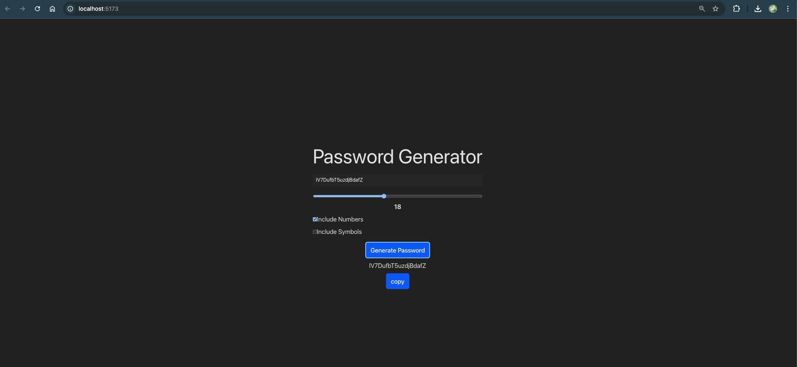

# 🔐 Password Generator App

A sleek and responsive password generator built using **React**. This app allows users to generate strong, random passwords based on selected criteria such as length, numbers, and special symbols.

## 💡 Features

- Adjustable password length (range: 8–32)
- Toggle to include:
  - ✅ Numbers
  - ✅ Special characters
- Real-time password generation
- One-click **copy to clipboard** functionality
- Clean dark-themed responsive UI

## 🛠️ Tech Stack

- React (Hooks: `useState`, `useCallback`, `useRef`)
- Clipboard API
- CSS (custom dark theme styling)

## 📸 Preview



## 🚀 How to Run Locally

```bash
git clone https://github.com/Manjindersingh28/password-generator.git
cd password-generator
npm install
npm start
